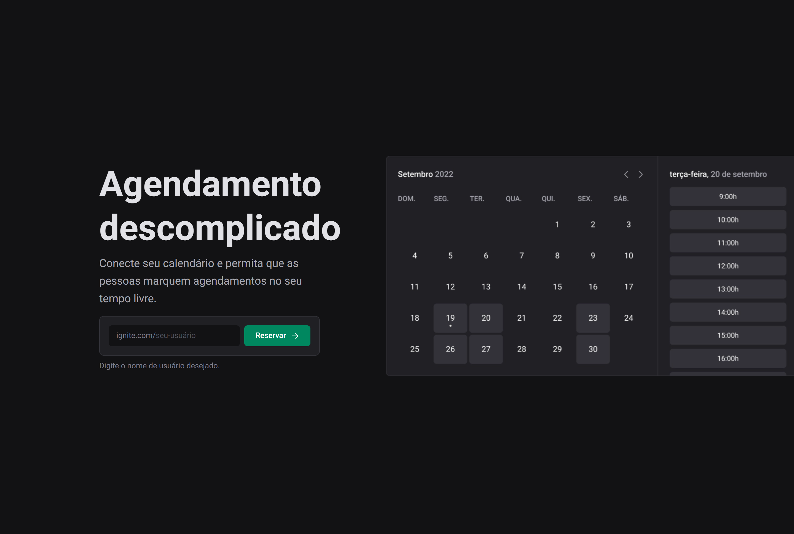

# Ignite Call

<!---Esses são exemplos. Veja https://shields.io para outras pessoas ou para personalizar este conjunto de escudos. Você pode querer incluir dependências, status do projeto e informações de licença aqui--->


<a href="https://ignite-call-sid.vercel.app" target="_blank">Demo</a>



<br />

## 💻 Sobre

O projeto Ignite Call é a solução perfeita para agendar reuniões de maneira rápida e eficiente. Com ele, você pode entrar na plataforma e cadastrar seus horários disponíveis. Em seguida, um link será gerado para que outras pessoas possam agendar uma reunião com você durante um desses horários.

Além disso, o Ignite Call é totalmente integrado ao Google Calendar, o que significa que todos os compromissos agendados serão automaticamente adicionados ao seu calendário. Isso significa que você não precisará se preocupar em adicionar manualmente cada reunião.

Foi utilizado tecnologias de ponta, como Next.js, React Query e Next Auth, para garantir que a plataforma seja rápida, fácil de usar e confiável. Além disso, a estilização da aplicação foi cuidadosamente planejada para garantir uma experiência agradável para o usuário.

Em resumo, o Ignite Call é uma aplicação full stack básica, projetada para tornar o agendamento de reuniões o mais simples e fácil possível.

<br />

## 🖱 Pré-requisitos

Antes de começar, verifique se você atendeu aos seguintes requisitos:

- Você instalou a versão mais recente de `node / npm / yarn`
  <br />
- Uma Instancia docker com o mysql mais recente
  <br />
- Um Cadastro no Google Cloud para a conexão com o google calendar
  <br />

## ☕ Usando o Ignite Call

Para usar o Ignite Call, siga estas etapas:

```
git clone https://github.com/SidneyRoberto9/ignite-call

yarn ou npm i

Agora crie uma .env na raiz do projeto e preencha as seguintes chaves:
DATABASE_URL: com o endereço de conexão ao banco criado posteriormente

GOOOGLE_CLIENT_ID: proveniente do Google Cloud
GOOOGLE_CLIENT_SECRET: proveniente do Google Cloud

NEXTAUTH_SECRET: qualquer chave md5 aleatória
NEXTAUTH_URL: o url da aplicação, normalmente sendo "http://localhost:3000"

conecte os schemas do prisma com o banco utilizando:
npx prisma migrate dev (para o banco em docker local)
npx prisma db push (para bancos com planetScale, Neon e outros)

yarn dev ou npm dev
```
